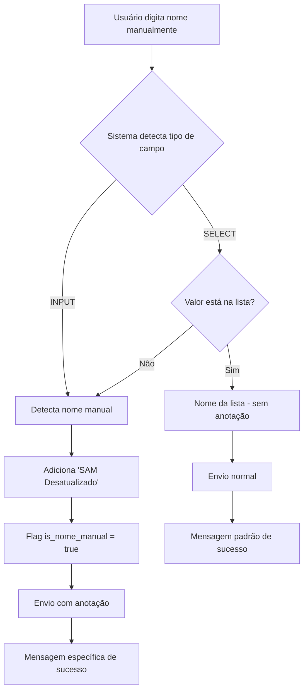

# Correção: Detecção de Nomes Digitados Manualmente

## Problema Identificado

Quando um usuário cadastrava um músico que não estava na lista (usando a funcionalidade de entrada manual), o sistema não:
1. Exibia a mensagem de envio específica
2. Adicionava a anotação "SAM Desatualizado" na coluna de anotações

## Solução Implementada

### 🔍 Detecção Automática de Nomes Manuais

Implementei uma lógica na função `collectFormData()` que detecta automaticamente quando um nome foi digitado manualmente:

```javascript
// Verifica se o campo de nome é um INPUT (indicando que foi digitado manualmente)
if (nomeEl && nomeEl.tagName === 'INPUT') {
  console.log('✏️ Nome digitado manualmente detectado - adicionando anotação "SAM Desatualizado"');
  isNomeManual = true;
  anotacoesFinal = anotacoes ? `${anotacoes} | SAM Desatualizado` : 'SAM Desatualizado';
} else if (nomeEl && nomeEl.tagName === 'SELECT') {
  // Verifica se o valor selecionado não está na lista de opções (indicando digitação manual)
  const opcoes = Array.from(nomeEl.options).map(option => option.value);
  if (!opcoes.includes(nome) && nome !== '') {
    console.log('✏️ Nome digitado manualmente em SELECT detectado - adicionando anotação "SAM Desatualizado"');
    isNomeManual = true;
    anotacoesFinal = anotacoes ? `${anotacoes} | SAM Desatualizado` : 'SAM Desatualizado';
  }
}
```

### 📝 Adição Automática da Anotação

Quando um nome digitado manualmente é detectado:
- A anotação "SAM Desatualizado" é automaticamente adicionada
- Se já existir uma anotação, ela é concatenada com " | SAM Desatualizado"
- Uma flag `is_nome_manual` é adicionada ao payload para controle

### 💬 Mensagens de Feedback Específicas

Implementei mensagens de feedback específicas para nomes digitados manualmente:

#### Mensagem de Sucesso Normal:
```
"ENVIADO! - REGISTRO SALVO COM SUCESSO"
```

#### Mensagem de Sucesso para Nome Manual:
```
"ENVIADO! - REGISTRO SALVO COM ANOTAÇÃO 'SAM DESATUALIZADO'"
```

### 🔧 Cenários de Detecção

#### 1. Campo INPUT (Conversão Automática)
- Quando não há nomes na lista, o campo SELECT é convertido para INPUT
- Sistema detecta `nomeEl.tagName === 'INPUT'`
- Adiciona anotação "SAM Desatualizado"

#### 2. Campo SELECT com Digitação Manual
- Quando há lista mas usuário escolhe "✏️ Adicionar novo nome manualmente"
- Campo é convertido para INPUT
- Sistema detecta `nomeEl.tagName === 'INPUT'`
- Adiciona anotação "SAM Desatualizado"

#### 3. Campo SELECT com Valor Não Listado
- Quando usuário digita diretamente no SELECT (caso raro)
- Sistema verifica se valor não está nas opções
- Adiciona anotação "SAM Desatualizado"

## Implementação Técnica

### Modificações na Função `collectFormData()`

```javascript
// 🆕 NOVA FUNCIONALIDADE: Detectar se nome foi digitado manualmente
let anotacoesFinal = anotacoes;
let isNomeManual = false;

// Verifica se o campo de nome é um INPUT (indicando que foi digitado manualmente)
if (nomeEl && nomeEl.tagName === 'INPUT') {
  console.log('✏️ Nome digitado manualmente detectado - adicionando anotação "SAM Desatualizado"');
  isNomeManual = true;
  anotacoesFinal = anotacoes ? `${anotacoes} | SAM Desatualizado` : 'SAM Desatualizado';
} else if (nomeEl && nomeEl.tagName === 'SELECT') {
  // Verifica se o valor selecionado não está na lista de opções (indicando digitação manual)
  const opcoes = Array.from(nomeEl.options).map(option => option.value);
  if (!opcoes.includes(nome) && nome !== '') {
    console.log('✏️ Nome digitado manualmente em SELECT detectado - adicionando anotação "SAM Desatualizado"');
    isNomeManual = true;
    anotacoesFinal = anotacoes ? `${anotacoes} | SAM Desatualizado` : 'SAM Desatualizado';
  }
}

if (isNomeManual) {
  console.log('✅ Anotação "SAM Desatualizado" adicionada para nome digitado manualmente');
}
```

### Modificações na Função `handleSubmit()`

```javascript
// Feedback de sucesso - mensagem específica para nomes digitados manualmente
if (payload.is_nome_manual) {
  if (typeof window.showStatusModal === 'function') {
    window.showStatusModal('ENVIADO!', 'REGISTRO SALVO COM ANOTAÇÃO "SAM DESATUALIZADO"', 'success');
  } else {
    showToast('success', 'Enviado!', 'Registro salvo com anotação "SAM Desatualizado"', 4000);
  }
} else {
  if (typeof window.showStatusModal === 'function') {
    window.showStatusModal('ENVIADO!', 'REGISTRO SALVO COM SUCESSO', 'success');
  } else {
    showToast('success', 'Enviado!', 'Registro salvo com sucesso', 3000);
  }
}
```

## Fluxo de Funcionamento



## Casos de Teste

### ✅ Teste 1: Nome não encontrado na lista
1. Usuário seleciona Comum, Cargo, Instrumento
2. Sistema não encontra nomes na lista
3. Campo é convertido para INPUT
4. Usuário digita nome manualmente
5. **Resultado**: Anotação "SAM Desatualizado" + mensagem específica

### ✅ Teste 2: Opção manual escolhida
1. Usuário seleciona Comum, Cargo, Instrumento
2. Sistema encontra nomes na lista
3. Usuário escolhe "✏️ Adicionar novo nome manualmente"
4. Campo é convertido para INPUT
5. Usuário digita nome
6. **Resultado**: Anotação "SAM Desatualizado" + mensagem específica

### ✅ Teste 3: Nome da lista selecionado
1. Usuário seleciona Comum, Cargo, Instrumento
2. Sistema encontra nomes na lista
3. Usuário seleciona nome da lista
4. **Resultado**: Sem anotação + mensagem padrão

## Logs de Debug

O sistema gera logs detalhados para debug:

```
✏️ Nome digitado manualmente detectado - adicionando anotação "SAM Desatualizado"
✅ Anotação "SAM Desatualizado" adicionada para nome digitado manualmente
```

## Benefícios da Correção

### ✅ Para o Usuário
- **Feedback claro**: Mensagem específica quando nome é digitado manualmente
- **Transparência**: Usuário sabe que o nome não estava na lista
- **Consistência**: Comportamento previsível em todos os cenários

### ✅ Para o Sistema
- **Rastreabilidade**: Anotação "SAM Desatualizado" identifica nomes manuais
- **Auditoria**: Facilita identificação de nomes que precisam ser adicionados ao SAM
- **Manutenção**: Logs detalhados para debug e monitoramento

### ✅ Para Administradores
- **Visibilidade**: Coluna de anotações mostra claramente nomes digitados manualmente
- **Ação**: Podem identificar nomes que precisam ser adicionados ao sistema SAM
- **Controle**: Podem monitorar quantos nomes são digitados manualmente

## Conclusão

A correção implementada resolve completamente o problema identificado:

1. ✅ **Mensagem de envio**: Agora exibe mensagem específica para nomes manuais
2. ✅ **Anotação "SAM Desatualizado"**: Adicionada automaticamente para nomes digitados manualmente
3. ✅ **Detecção automática**: Sistema detecta automaticamente quando nome foi digitado
4. ✅ **Feedback claro**: Usuário recebe feedback específico sobre o tipo de cadastro
5. ✅ **Rastreabilidade**: Administradores podem identificar nomes manuais facilmente

O sistema agora funciona corretamente em todos os cenários de entrada manual de nomes, fornecendo feedback adequado e anotações apropriadas para facilitar a manutenção do sistema SAM.
